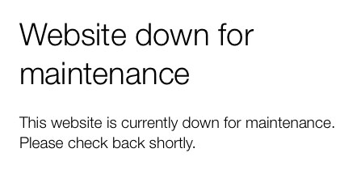

# Maintenance screen

During some of the activities Deploynaut will put up an automated maintenance screen for the duration of the process.

This will result in 503 responses from the server and a default outage message will be shown. It is possible
to customise this message by creating an *ErrorPage* in the CMS and selecting 503 as the error code. This generates an
`assets/error-503.html` file, which is then automatically recognised by Deploynaut.

From the technical perspective, Deploynaut creates temporary `.htaccess` and `maintenance.html` files. It assumes that
the codebase comes with `.htaccess`, so this is renamed and stored for later retrieval. Websites must not create their
own `maintenance.html` however as this will cause deployments to fail or the file to be destroyed. The maintenance page
will either be uploaded from Deploynaut template, or created from `assets/error-503.html` (if available).

`.htaccess` is then used to redirect all requests to the maintenance page. After the process has completed (or failed)
the former `.htaccess` is restored and `maintenance.html` removed.

