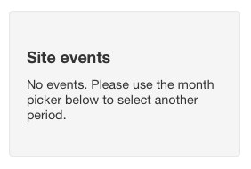
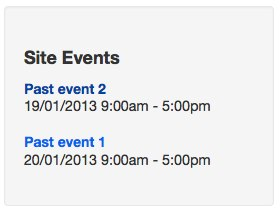
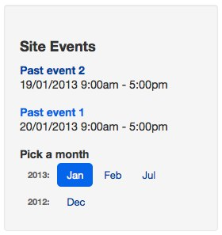
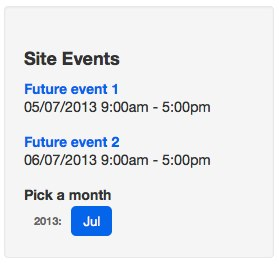

<!--
title: Adding a calendar
-->

# Adding a calendar

This how-to will guide a developer wanting to add a custom event calendar into his own template. The **Event Pages** and
**Event Holders** are created separately - this tutorial does not depend on any special site tree setup.

## Obtaining the events

First of all we need to decide which events will be included in the calendar. Let's start with creating a calendar that
will display all events available on the site.

One option would be to use SilverStripe Framework's ORM to create a normal `DataList` and feed that to the template.
But to make things simpler (albeit less customisable) we can also use the wrapper function provided by the `EventHolder`
class. Let's take a closer look at the function declaration.

	:::php
	public static function AllEvents($parentID = null, $tagID = null, $dateFrom = null, $dateTo = null, $year = null,
			$monthNumber = null)

The only thing we are looking to control is the currently displayed month. This variant provides us with `$year` and
`$monthNumber` that allow us to do so.

## The GET parameters

The month selection is done (similarly to `EventHolder`) on the basis of the `year` and `month` GET parameters. The
parameters can then be passed to `AllEvents` to produce the single-month listing.

We can create a function that will parse the parameters and provide us with a neat array of SQL-safe variables. We start
by getting the parameters from the `SS_HTTPRequest`.

	:::php
	public function parseEventParams() {
		$year = $this->request->getVar('year');
		$month = $this->request->getVar('month');

We need to sanitise them before doing anything else. We could use `Convert` helper class to do it, or simply cast the
value:

	:::php
		if (isset($year)) $year = (int)$year;
		if (isset($month)) $month = (int)$month;

Next, since the month without year doesn't have much sense, we make sure that we check for validity and reset to
defaults if needed. This assures us that we don't end up displaying a listing of all site events.

	:::php
		// Default to current month if either not provided.
		if (!isset($month) || !isset($year)) {
			$year = SS_Datetime::now()->Format('Y');
			$month = SS_Datetime::now()->Format('m');
		}

Then we return the array with cleaned up data that we will use shortly.

	:::php
		return array(
			'year' => $year,
			'month' => $month
		);
	}

Note that these parameters need to be `year` and `month` since that's what `EventHolder::ExtractMonth` (described
later) uses internally.

## Obtaining the events continued

Now that we have the parameters available, we can combine that with `AllEvents` to fetch the data and show it in the
template. Let's create a getter in the `Page_Controller` (or wherever you are attempting to create the calendar).

	:::php
	public function SiteEvents() {
		$params = $this->parseEventParams();
		return EventHolder::AllEvents(null, null, null, null, $params['year'], $params['month']);
	}

We can now access the events for the currently selected (or default) month in the template, say `Page.ss`. Here is how
to iteratively loop through the events:

	:::ss
		<h3>Site Events</h3>
		<% loop SiteEvents %>
			

				<h4><a href="$Link">$Title</a></h4>
				
$Date.Nice $StartTime.Nice - $EndTime.Nice

			

		<% end_loop %>

We can also provide an alternative string if no events are found:

	:::ss
	<% if SiteEvents %>
		... above event loop
	<% else %>
		
No events. Please use the month picker below to select another period.

	<% end_if %>

We can already test this snippet of code (this is using the *default* theme and Bootstrap `well` and `span3` classes):

If we have no current events, as in the previous example, we can test the code by switching to another month using the
GET parameters. Let's try `?year=2013&month=1`.

That's pretty good.

## Extracting available months

We now need an interface to select the valid months from the calendar. The data for this can easily be extracted by
using `ExtractMonths` (see `EventHolder.php` for the more detailed description of the method). This function accepts a
list of events to extract the months from and also some state parameters: current URL, currently selected month and
year.

Since we actually want to extract months from all events on the site we will use `EventHolder::AllEvents` without
parameters. Supplying current month and year allows `ExtractMonths` to provide us with a flag marking the current
month so we can highlight it in the frontend.

	:::php
	public function SiteEventMonths() {
		$params = $this->parseEventParams();
		
		return EventHolder::ExtractMonths(
			// This is the list of events to walk through.
			EventHolder::AllEvents(),
			// The link will default to current URL, which we want.
			null,
			// These are for producing the "Active" flag on resulting months.
			$params['year'],
			$params['month']
		);
	}

The returned data structure (detailed in `EventHolder` as well) will alow us to construct the template pagination
control. Here is an example of this with some extra comments added in (see at the bottom of this how-to for the full
listing).

	:::ss
	<h5>Pick a month</h5>
	
	

		<%-- Loop through years first --%>
		<% loop SiteEventMonths %>
			<h6 class="year">$YearName:</h6>
		
			<%-- Then loop through months within each year --%>
			<ol class="nav nav-pills unstyled months">
				<% loop Months %>
		
					<%-- use the Active, MonthLink and MonthName to produce the pagination --%>
					<li <% if Active %>class="active"<% end_if %>><a href="$MonthLink.XML">$MonthName</a></li>
		
				<% end_loop %>
			</ol>
		<% end_loop %>
	

The `Active` will be set to true for the month that is the same as the currently selected one. The `MonthLink` is the
link built on the basis of the current URL, plus the `year` and `month` GET params needed for selecting the relevant
month. The `MonthName` is a three-letter shorthand for a month, such as "Apr".

Here is how will the calendar appear with the month picker added in:

## Limiting the events in the calendar

We don't have to display all events in the calendar. It's just as meaningful to show for example all events with a
specific tag. The modification is simple. Get the tag using the ORM as you'd normally do and provide its ID as the
second parameter to both `AllEvents` function used in this how-to.

	:::php
	// Get the tag
	$tag = TaxonomyTerm::get()->filter(array('Name' => 'Future'))->First();
	...
	// Modify both AllEvents call in SiteEvents
	return EventHolder::AllEvents(null, $tag->ID, null, null, $params['year'], $params['month']);
	...
	// And in SiteEventMonths
	return EventHolder::ExtractMonths(
		EventHolder::AllEvents(null, $tag->ID),
		null,
		$params['year'],
		$params['month']
	);

That will filter out events that are not marked as "Future".

## Code listing

Code for `Page_Controller` class (or your custom page type):

	:::php
	public function parseEventParams() {
		$year = $this->request->getVar('year');
		$month = $this->request->getVar('month');
		if (isset($year)) $year = (int)$year;
		if (isset($month)) $month = (int)$month;
	
		// Default to current month if either not provided.
		if (!isset($month) || !isset($year)) {
			$year = SS_Datetime::now()->Format('Y');
			$month = SS_Datetime::now()->Format('m');
		}
	
		return array(
			'year' => $year,
			'month' => $month
		);
	}
	
	/**
	 * Prepare the data structure on which navigation can be built.
	 */
	public function SiteEventMonths() {
		$params = $this->parseEventParams();
	
		return EventHolder::ExtractMonths(
			EventHolder::AllEvents(),
			null,
			$params['year'],
			$params['month']
		);
	
	}
	
	/**
	 * Produce a list of events, as assigned to the current or currently selected month.
	 */
	public function SiteEvents() {
		$params = $this->parseEventParams();
	
		return EventHolder::AllEvents(null, null, null, null, $params['year'], $params['month']);
	}

Code for `Page.ss` template:

	:::ss
	

	
		<h3>Site events</h3>
	
		<% if SiteEvents %>
			<% loop SiteEvents %>
				

					<h4><a href="$Link">$Title</a></h4>
					
$Date.Nice $StartTime.Nice - $EndTime.Nice

				

			<% end_loop %>
		<% else %>
			
No events. Please use the month picker below to select another period.

		<% end_if %>
	
		

			<h5>Pick a month</h5>
	
			<% if SiteEventMonths %>
				

					<% loop SiteEventMonths %>
						<h6 class="year">$YearName:</h6>
						<ol class="nav nav-pills unstyled months">
						<% loop Months %>
							<li <% if Active %>class="active"<% end_if %>><a href="$MonthLink.XML">$MonthName</a></li>
						<% end_loop %>
						</ol>
					<% end_loop %>
				

			<% end_if %>
		

	

